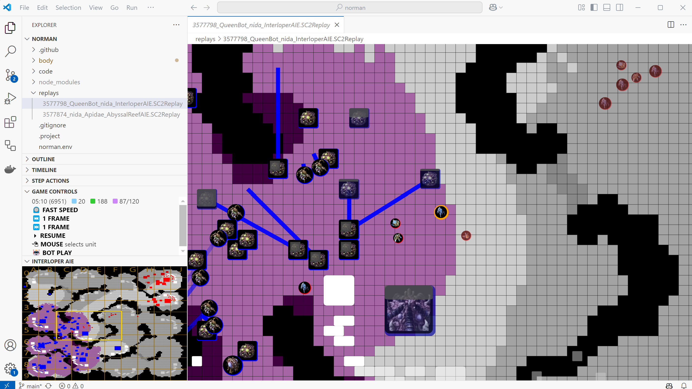

When watching a replay or a game of your bot, you have control over the position of the camera through the camera and minimap view
as well as your mouse and keyboard.

* Move the camera with a mouse click on the minimap. The minimap marks the range of camera in an orange frame 
* Move the camera with the arrow keys. The focus must be on the camera view so make sure to click on it first
* Zoom in and out with the mouse wheel. The focus must be on the camera view so make sure to click on it first
* Select a unit with a mouse click. The camera will mark the selected unit in orange and will follow it when it moves

