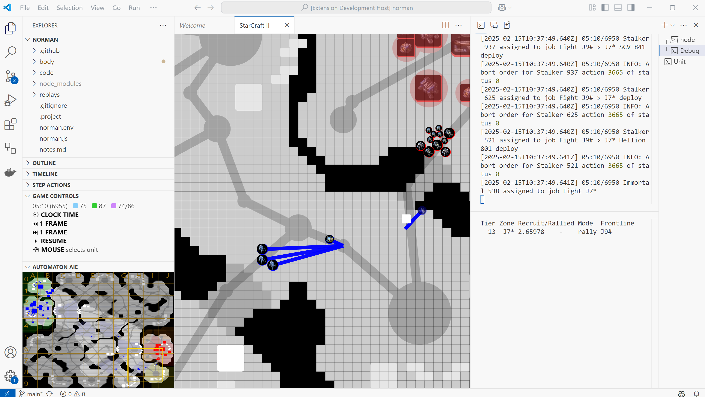

When playing a game your bot can use the debug commands to add information to the camera, minimap and the debug terminal.

This screenshot demonstrates:
* A dynamic list of "battles" the bot engages in - as text in the `Debug` terminal to the right
* The coordinates of "zones" on the map and the path between them - as lines in the camera view
* The "alert levels" of the "zones" on the map - as colors on the minimap

The following debug commands are supported at the moment:
* Debug draw lines will show lines on camera and minimap
* Debug draw spheres will show circles on camera and minimap
* Debug draw text
    * with virtual position - `virtualPos` - will show in the `Debug` terminal. The x coordinate will be used to split debug info into tabs in the future
    * without virtual or world position - will be interpreted as a shape, e.g.:
        * `{ shape: "circle", x: <x coordinate of center>, y: <y coordinate of center>, r: <radius>, color: <color> }`
        * `{ shape: "line", x1: <start x>, y1: <start y>, x2: <end x>, y2: <end y>, width: <line width>, color: <color> }`
        * `{ shape: "polygon", points: [<x1>, <y1>, <x2>, <y2>, ...], color: <color> }`
