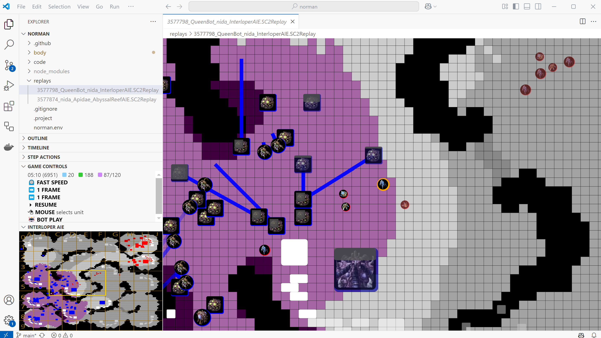

When watching a replay or a game of your bot, you have control over the speed of the game.
You can also pause and skip back and forth.
Some controls are available only when watching a replay or when playing a game.

# Common controls

The following controls are available when watching a replay or when playing a game:

* Change the speed from `FAST SPEED`, to `CLOCK TIME`, to `X2 SLOWER`, to `X4 SLOWER`, to `X16 SLOWER`, and back to `FAST SPEED`
* Pause and resume. You can use the buttons under `GAME CONTROLS` or `Spacebar` key when the focus is on the camera view
* While paused, move one frame back or forth. This is limited to 10 seconds before the time the game was paused.

# Replay controls

The following controls are available only when watching a replay:

* Skip 1 minute
* Continue the game with your bot playing. See [how](start-game/continue-game.md)

# Play controls

The following controls are available only when your bot plays a game:

* Change mouse mode from `MOUSE selects unit`, to `MOUSE spawns unit`, to `MOUSE kills unit`, and back to `MOUSE selects unit`

