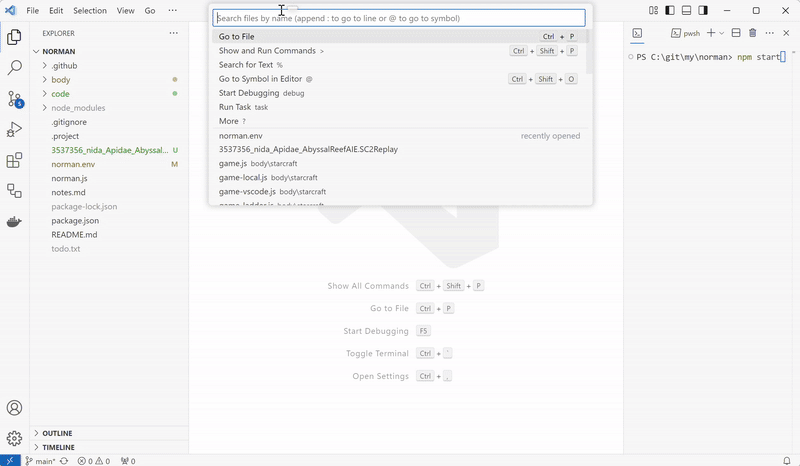

# StarCraft II for AI

Run your AI bots with StarCraft II within Visual Studio Code.

## Features

Visualizes StarCraft II games and replays directly in your IDE.
You don't need an installation of the game on your machine.
You can improve the code of your bot and troubleshoot it without leaving Visual Studio Code.

To run a replay, drag and drop a replay file (*.SC2Replay) into the Editor area of Visual Studio Code. If you have the file in your workspace, open it with a click.

To play a game with your bot, start StarCraft II by opening the command palette with `Ctrl+Shift+P` and typing `Start StarCraft II for an AI bot`.

In both cases, a viewer will start checking all pre-requisites until the game is ready for viewing.
Then the editor will show game camera.
The left side will host game controls and a minimap.
You can click on the minimap to move the camera.

## Limitations

The headless StarCraft II is built for the following architectures:
* linux/amd64
* linux/arm64

Only the following maps can be used for playing the game or viewing replays:
* AbyssalReefAIE
* AcropolisAIE
* AutomatonAIE
* EphemeronAIE
* InterloperAIE
* ThunderbirdAIE

The following ports must be available on the host machine:
* 5000 - This is the port for your bot to connect to.
* 5001 - This port is used to monitor the game events exchanged between your bot and StarCraft II.

## Acknowledgements

This extension to Visual Studio Code makes use of [StarCraft II API](https://github.com/Blizzard/s2client-proto) and its headless StarCraft II linux build,
and the AI edition maps by [AI Arena](https://aiarena.net/).
Thanks for your great work!

Make sure to read the license of the above work and to agree with it before using this extension:
* [BLIZZARD® STARCRAFT® II AI AND MACHINE LEARNING LICENSE](https://blzdistsc2-a.akamaihd.net/AI_AND_MACHINE_LEARNING_LICENSE.html)
