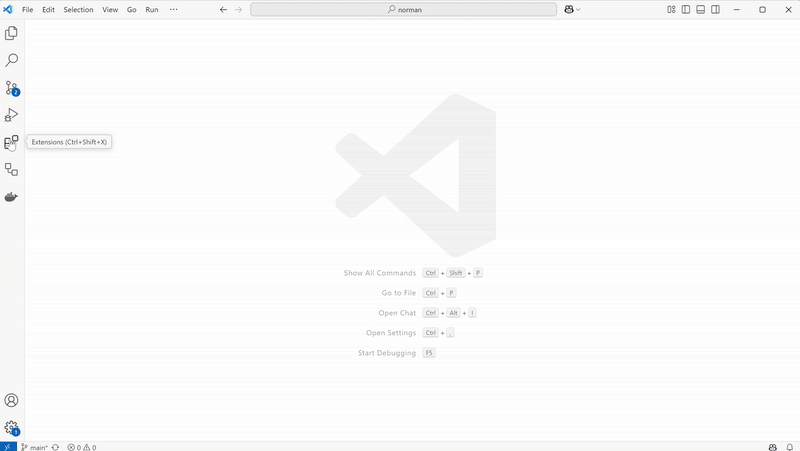
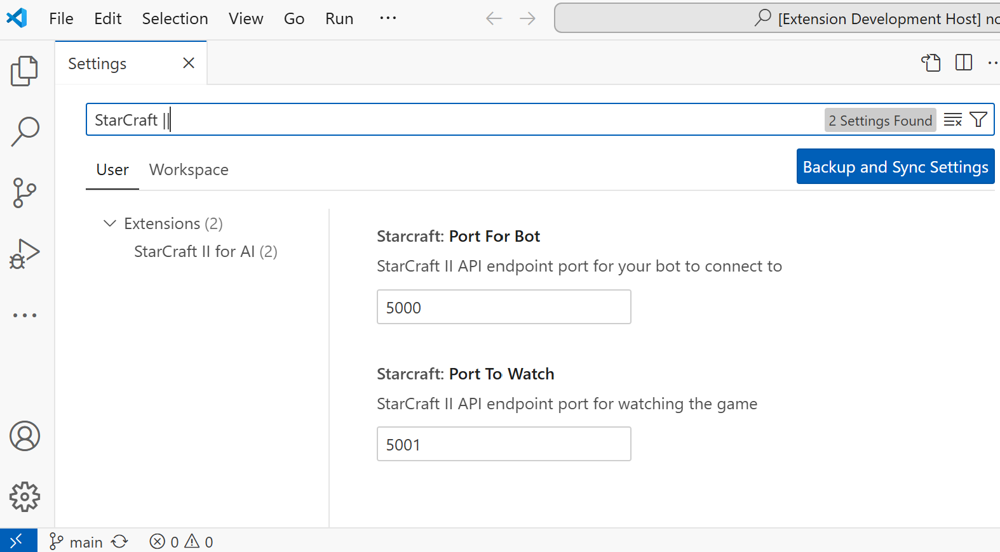

# Pre-requisites

StarCraft II for AI requires:
* Visual Studio Code - [Install Visual Studio Code](https://code.visualstudio.com/docs/setup/setup-overview)
* Docker - [Install Docker](https://docs.docker.com/get-started/get-docker/) and start it
* StarCraft II - A headless game client is downloaded by StarCraft II for AI when watching a replay or starting a game at step "Download StarCraft II". If the step fails you can download the game client manually using `docker pull --platform linux/amd64 stephanzlatarev/starcraft` in a command prompt and troubleshoot connectivity issues

# Install StarCraft II for AI in Visual Studio Code

StarCraft II for AI is an extension to Visual Studio Code.
You can install it from the marketplace.

The extension is also available for download in
[Visual Studio Marketplace](https://marketplace.visualstudio.com/items?itemName=stephanzlatarev.vscode-starcraft),
[Open VSX Registry](https://open-vsx.org/extension/stephanzlatarev/vscode-starcraft)
and [GitHub](https://github.com/stephanzlatarev/vscode-starcraft/releases).

# Change game ports if necessary

Two network ports on the local host are used for running and watching the game.
You can change the defaults - `5000` and `5001` - if these conflict with other software on your machine.

