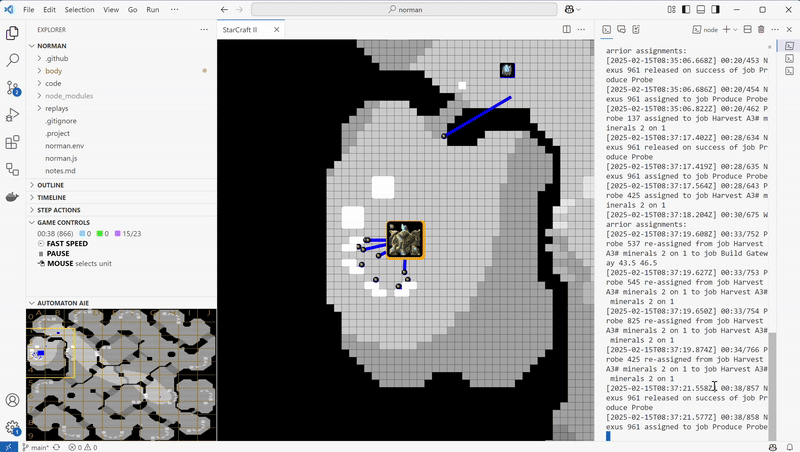

Start a new game for your bot to play against the computer:
* During a running or paused game, stop your bot
* Make chages to the code of your bot, add breakpoints, anything...
* Start your bot

Your bot will reconnect to the same game at the same game loop.
However, your bot will have lost its internal state so take this into consideration when observing any differences in behavior.
