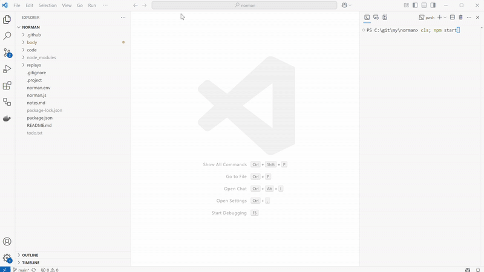

Start a new game for your bot to play against the computer:
* Press `Ctrl+Shift+P` to open the command palette in Visual Studio Code
* Type `Start StarCraft II for an AI bot` to find the command
* Run the command. A new editor will open and will go through the pre-requisites
* When asked about the map and race and difficulty of the opponent, make your choices
* Press `Start` to start the game
* When you see "Wait for a bot to join the game", start your bot

