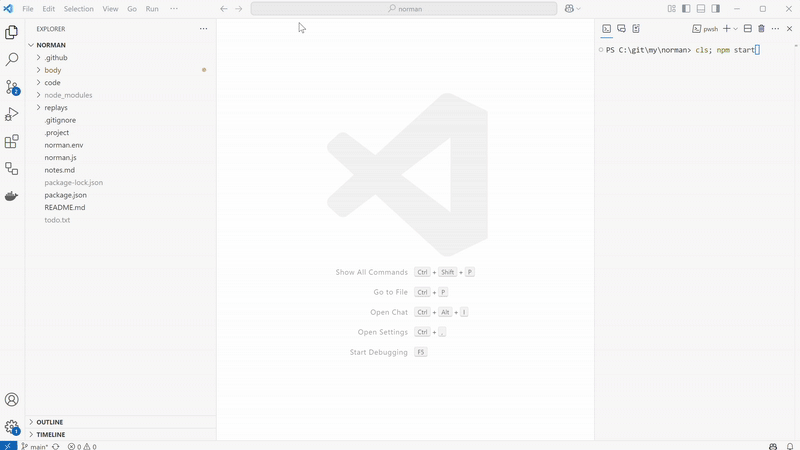
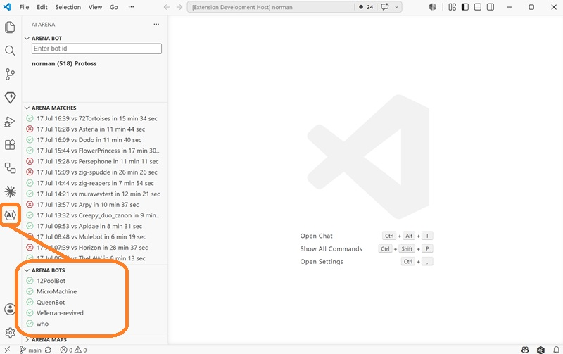
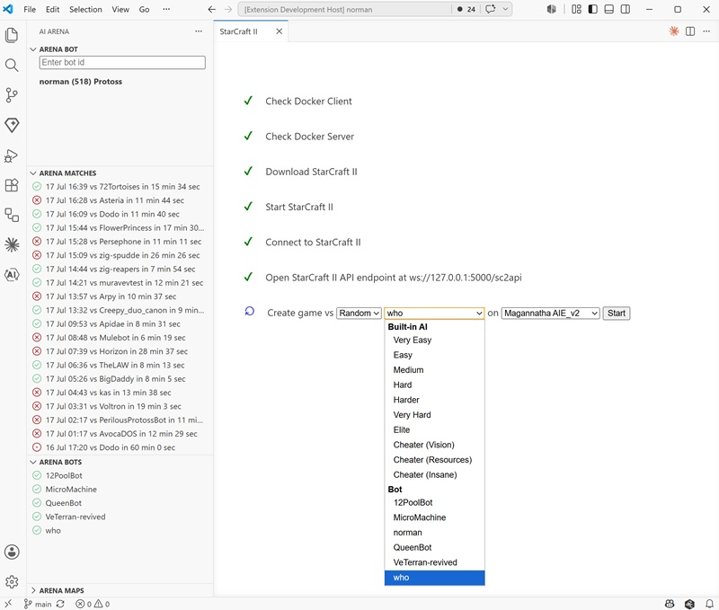

## Against the built-in AI

Start a new game for your bot to play against the computer:
* Press `Ctrl+Shift+P` to open the command palette in Visual Studio Code
* Type `Start StarCraft II for an AI bot` to find the command
* Run the command. A new editor will open and will go through the pre-requisites
* When asked about the map and race and difficulty of the opponent, make your choices
* Press `Start` to start the game
* When you see "Wait for a bot to join the game", start your bot

## Against an AI Arena bot

When you set your [AI Arena](https://aiarena.net/) API token in the extension settings, the extension automatically downloads a set of publicly available bots and shows them in the **Arena bots** view in the AI Arena panel.

Each bot shows a filled icon once it has been downloaded and is ready to play against.

To start a game against one of these bots:
* Press `Ctrl+Shift+P` to open the command palette
* Type `Start StarCraft II for an AI bot` and run the command
* When asked about the opponent, select one of the downloaded bots from the list
* Choose the map
* Press `Start` to start the game
* When you see "Wait for a bot to join the game", start your bot

Your bot and the selected opponent bot will both connect to the game and play against each other.
