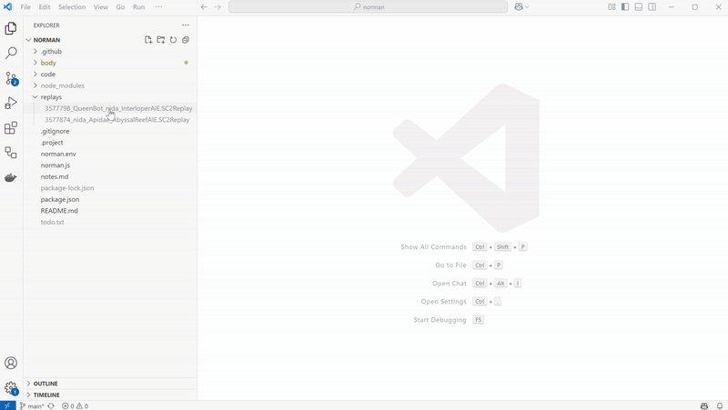
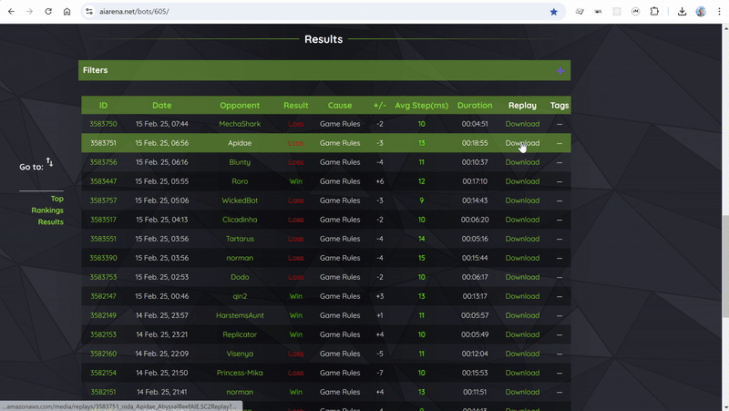

Watch a replay by opening its SC2Replay file.

You can watch only one replay file at a time.
The headless StartCraft II game may need to be downloaded before opening a replay and this may take a few minutes.
If the replay doesn't start, check if all [pre-requisites](../installation.md#pre-requisites) are met.
Only replays on [supported maps](../index.md#limitations) can be opened.

You can add replay files to the folder in VS Code and then watch them by selecting the files.

You can associate the file extension to VS code and then watch them by opening the file in your operating system.

